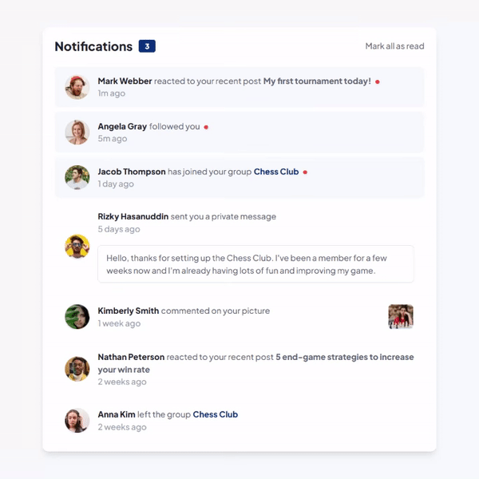

# Frontend Mentor - Notifications page solution

This is a solution to the [Notifications page challenge on Frontend Mentor](https://www.frontendmentor.io/challenges/notifications-page-DqK5QAmKbC).

## Table of contents

- [Overview](#overview)
  - [The challenge](#the-challenge)
  - [Preview](#preview)
  - [Links](#links)
- [My process](#my-process)
  - [Built with](#built-with)
  - [What I learned](#what-i-learned)
  - [Useful resources](#useful-resources)
- [Author](#author)

## Overview

### The challenge

Users should be able to:

- Distinguish between "unread" and "read" notifications
- Select "Mark all as read" to toggle the visual state of the unread notifications and set the number of unread messages to zero
- View the optimal layout for the interface depending on their device's screen size
- See hover and focus states for all interactive elements on the page

### Preview
<p align="center">
    
</p>

### Links

- Solution URL: [frontendmentor.io/solutions/notifications-page-yTP3VTrh7V](https://www.frontendmentor.io/solutions/notifications-page-yTP3VTrh7V)
- Live Site URL: [notifications-page-acyein.vercel.app](https://notifications-page-acyein.vercel.app/)

## My process

### Built with

- Tailwind CSS
- React
- Next.js

### What I learned

- Understanding how to set updated count using the React hook '[useEffect](https://react.dev/reference/react/useEffect)'.
- Practise iterating through items using the [map()](https://developer.mozilla.org/en-US/docs/Web/JavaScript/Reference/.Global_Objects/Array/map) method.

```js
const [number, setNumber] = useState(0);

useEffect(() => {
    function totalNotifications(notifications) {
        setNumber(0);
        notifications.map(notification => {
            // if isRead is false, plus 1 to total
            notification.isRead === false && setNumber(number => number + 1);
        });
    }
    totalNotifications(notifications);
}, []);

function handleClick() {
    notifications.map(notification => {
        // if isRead is false, minus 1 from total & set isRead to true
        notification.isRead === false && ((setNumber(number => number - 1), (notification.isRead = true)))
    })
}
```

### Useful resources

- [@jaafar2000/notifications-page-main](https://github.com/jaafar2000/notifications-page-main/blob/main/src/App.js) - This source code helped me understand how to implement `useEffect`.

## Author

- Website - [Chian Yein](https://angchianyein.netlify.app/)
- Frontend Mentor - [@acyein](https://www.frontendmentor.io/profile/acyein)
